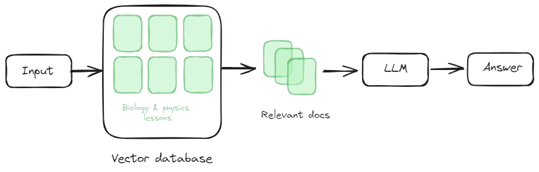
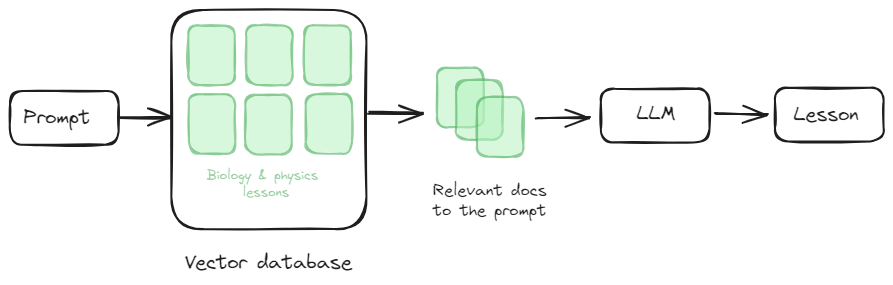
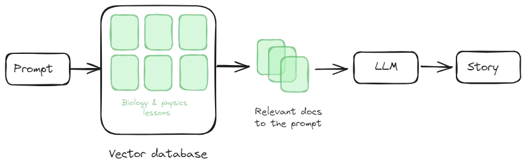

# AutiLearn

AutiLearn is an innovative, AI-driven learning platform designed to help children with autism develop essential skills in biology. By leveraging the power of AI, AutiLearn provides a fun and engaging learning experience tailored to the unique needs of each child.

All our AI features are based on Retrieval Augmented Generation (RAG). This means that we aren't just doing prompt engineering; we have constructed a knowledge base containing a curated list of articles related to Science (Biology, Physics, etc.) for kids. We use this knowledge base in all features to provide well-informed answers. You can check the `/notebooks` directory to see the notebook for populating the vector base.

## Overview of Retrieval Augmented Generation

Retrieval Augmented Generation (RAG) is a technique that combines the strengths of retrieval-based and generation-based approaches. When we receive an input, we perform a similarity search in our vector database to find relevant documents. These documents are then used to craft a well-informed prompt, which is processed to generate a grounded and accurate response.

Below is a diagram illustrating the RAG process:


## Features

### Chatbot

- Generating learning path courses
- Generating quizzes for the courses
- Generating stories

All the features are deployed in Render via the endpoint: [https://mega-hackathon-2024.onrender.com](https://mega-hackathon-2024.onrender.com)

### Chat

The Chat endpoint allows users to interact with our virtual assistant for real-time support and guidance. The assistant uses RAG to provide personalized and accurate responses based on the knowledge base.

**Explanation:**
We take the user query and the chat history to refine the query for a similarity search. This process involves several steps to ensure we provide accurate and contextually relevant information.

1. **Refinement of Query**: The initial user query and the chat history are analyzed to refine the query for the similarity search. This refinement process helps in understanding the user's intent more accurately and ensures that the search is contextually relevant.

2. **Similarity Search**: Once the query is refined, it is used to perform a similarity search in our vector database. The vector database contains embeddings of documents from our knowledge base, which includes curated articles and books related to mental health.

3. **Retrieval of Relevant Documents**: The similarity search retrieves the most relevant documents from the vector database. These documents are selected based on their relevance to the refined query.

4. **Combining Information**: The retrieved documents, along with the chat history and the refined query, are combined. This combination provides a comprehensive context for generating a response.

5. **Generating Response**: The combined information is sent to the Large Language Model (LLM), which generates a well-grounded and informative response. The LLM leverages the context provided by the retrieved documents and the chat history to ensure the response is accurate and relevant.

For more accurate responses, we are using the queries in the chat history to improve the similarity search. Below is a diagram illustrating this process:
.png>)

**URL:** `endpoint/chat`

**Input:**
When making a request to our API, the input should be structured in the following JSON format:

```json
{
  "query": "string",
  "chat_history": ["string"]
}
```

- `query`: This field represents the current user query. It is a string containing the user's question or statement that needs a response.
- `chat_history`: This is an array of strings representing the chat history between the user and the virtual assistant. Each object contains:
  - `role`: A string indicating the role of the participant in the conversation. Typical values are "user" for the user's inputs and "model" for the responses from the virtual assistant.
  - `parts`: An array of strings representing the parts of the conversation from the respective role. This allows for breaking down the conversation into manageable pieces for better context understanding.

**Output:**

```json
{
  "response": "str"
}
```

## Lesson Generation

This feature generates courses from our knowledge base, providing users with rich and informative content tailored to their needs. The generation process leverages RAG to ensure that the content is accurate and relevant.

Below is a diagram illustrating the Content Generation process:


**URL:** `endpoint/generate_course`

**Input:**
When making a request to the Course Generation endpoint, the input should be structured in the following JSON format:

```json
{
  "type": "string",
  "topic": "string"
}
```

**Output:**
The output will be a JSON object containing the generated content.

```json
{
  "course_content": "string"
}
```

## Story Generation

This feature generates stories providing users with rich and informative content tailored to their needs. The generation process leverages RAG to ensure that the content is accurate and relevant.

Below is a diagram illustrating the Content Generation process:


**URL:** `endpoint/generate_story`

**Input:**
When making a request to the Story Generation endpoint, the input should be structured in the following JSON format:

```json
{
  "type": "string",
  "topic": "string"
}
```

**Output:**
The output will be a JSON object containing the generated content.

```json
{
  "story_content": "string"
}
```

## Generating Quizzes

Based on the course content, we generate quizzes about it. The input should be structured in the following JSON format:

**Input:**

```json
{
  "course_content": "string"
}
```

**Output:**
The output will be a JSON object containing the generated quizzes.

```json
{
  "quiz_content": "string"
}
```
